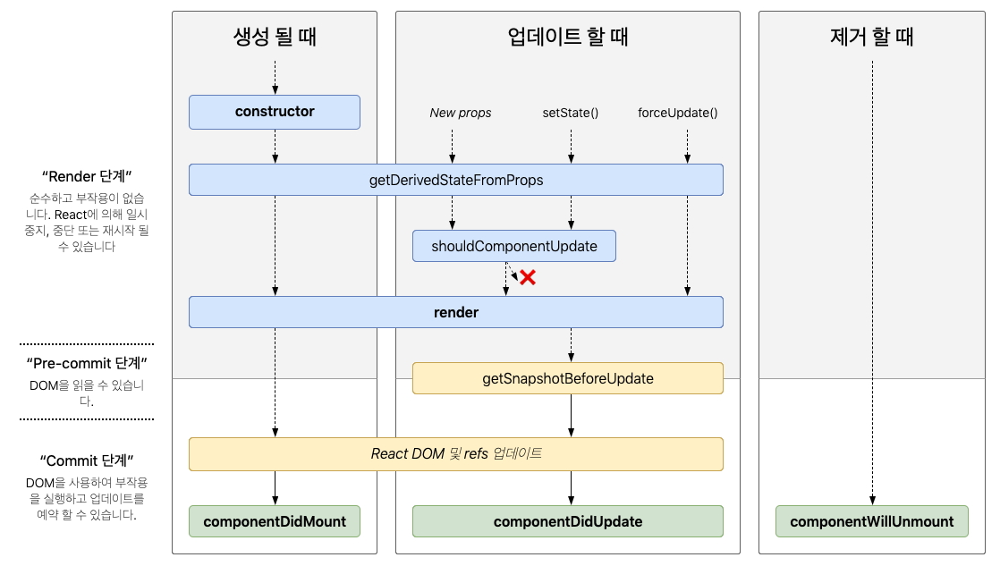
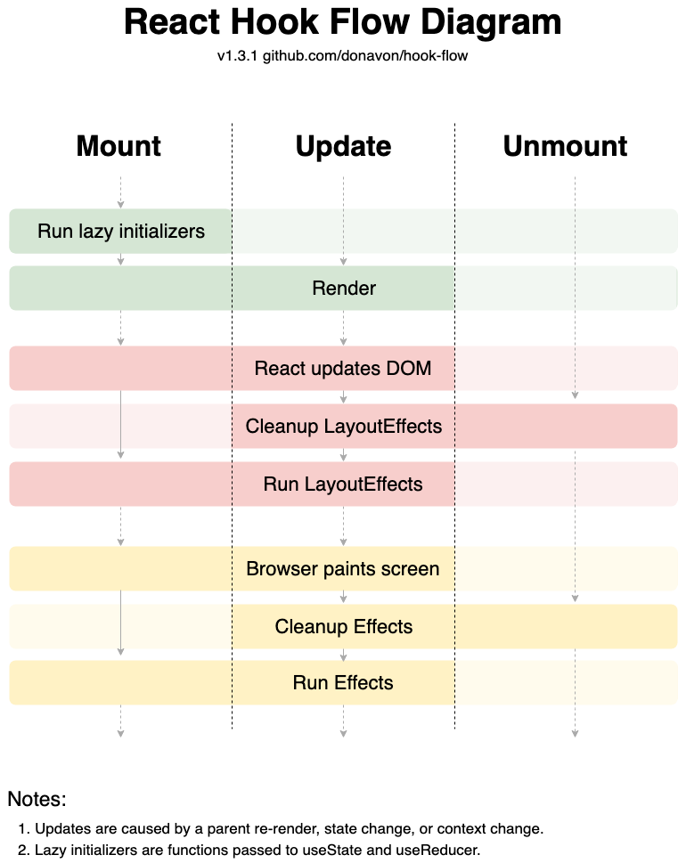

클래스형 컴포넌트의 설명으로 시작해서 클래스형 컴포넌트의 문제점. 해결 방법으로 나온 함수형 컴포넌트와 훅을 설명해보고 동작 방식 까지 깊게 알아보자.

자세한 훅 사용법은 담지 않음. 사용법은 공식문서 참조!

### 레퍼런스

https://ko.legacy.reactjs.org/docs/hooks-intro.html#gradual-adoption-strategy
https://react.vlpt.us/basic/25-lifecycle.html

<hr/>

_우선 클래스 컴포넌트와 라이프 사이클 메서드를 이해해야 훅의 등장배경과 목적을 알 수 있다._

## 리액트의 라이프 사이클 메서드을 설명해주세요.



1. 컴포넌트가 최초로 생성될 때 라이프 사이클
   - constructor
     클래스 생성자 메서드
   - getDerivedStateFromProps
     prop을 state에 할당
   - render
     컴포넌트를 렌더링
   - componentDidMount
     컴포넌트의 렌더링이 끝나고 호출되는 메서드, DOM의 속성을 읽거나 변경 가능, ajax 요청도 여기서 일어난다.

</br>
  
2. 컴포넌트가 업데이트 되었을 때 라이프 사이클
   * getDerivedStateFromProps (
    prop을 state에 할당
   * shouldComponentUpdate
    컴포넌트가 리렌더링 할지 말지를 결정하는 메서드
   * render
   * getSnapshotBeforeUpdate
   컴포넌트에 변화가 일어나기 직전의 DOM 상태를 가져와서 특정 값을 반환하면 그 다음 발생하게 되는 componentDidUpdate 함수에서 받아와서 사용을 할 수 있다 
   * componentDidUpdate 
   리렌더링이 마치고, 화면에 우리가 원하는 변화가 모두 반영되고 난 뒤 호출되는 메서드. 3번째 파라미터로 getSnapshotBeforeUpdate 에서 반환한 값을 조회 할 수 있다.

</br>
3. 컴포넌트가 제거 될 때 라이프 사이클
   * componentWillUnmount
   포넌트가 화면에서 사라지기 직전에 호출, 주로 DOM에 바인딩한 이벤트 제거

## 함수형 컴포넌트와 클래스형 컴포넌트는 어떤 차이가 있나요?

1. this 키워드 사용의 차이
   클래스형 컴포넌트에서는 state,prop에 접근할 때 this키워드를 사용하여 접근한다. (this.state, this.props). 함수형 컴포넌트에서는 this키워드를 사용할 수 없다. state, prop에 접근할 때 추가적인 키워드 없이 바로 접근이 가능하다.

2. 생명주기 메서드 사용의 차이
   클래스형 컴포넌트에서는 생명주기 메서드를 사용하여 특정 시점에 작업을 실행한다. componentDidMount, componentDidUpdate, componentWillUnmount 등이 있다. 함수형 컴포넌트에서는 생명주기 메서드를 사용할 수 없다. 대신 useEffect라는 함수를 사용하여 특정 시점에 작업을 처리한다. useEffect처럼 생명주기 메서드 다루는 것을 포함하여 리액트의 기능을 효과적으로 다룰 수 있게 해주는 함수를 Hook이라고 한다.

3. 상태 관리의 차이
   this키워드로 접근하여 this.setState, this.state를 사용하여 상태를 관리한다. 함수형 컴포넌트에서는 useState라는 훅을 사용하여 상태를 관리한다.

## 그렇다면 왜 요즘에는 함수형 컴포넌트를 많이 쓰나요?

- js에서 this사용의 혼란
- 각 생명주기에 관련없는 메서드들이 들어가기도 함. 무결성을 쉽게 해침.
- Class 컴포넌트의 구별, 각 요소의 사용 타이밍 등은 숙련된 React 개발자 사이에서도 의견이 일치하지 않았다.

## 훅이 뭔가요?

Hook은 함수 컴포넌트에서 React state와 생명주기(lifecycle)를 “연동(hook into)“할 수 있게 해주는 함수입니다. 즉 라이프 사이클 메서드를 쉽게 사용할 수 있도록 만든 함수. 훅으로 인해 class 없이 리액트 컴포넌트를 작성할 수 있게 되었다.

## 훅의 동작 순서는 어떻게 되나요?



## setState는 어떻게 동작하나요?

클래스 컴포넌트에서는 this.setState를 호출한다.
this.setState는 state를 병합한다
ex)

```js
this.state = { name: 'jane', age: 20 }
this.setState({ age: 21 })
console.log(this.state) // {name: 'jane', age: 21}
```

함수형 컴포넌트에서는 state를 다룰 때 useState를 사용한다.
useState는 상태를 병합하는 것이 아닌 대체한다

ex)

```js
const [state, setState] = useState({ name: 'jane', age: 20 })
setState({ age: 21 })
console.log(state) // {age: 21}
```
